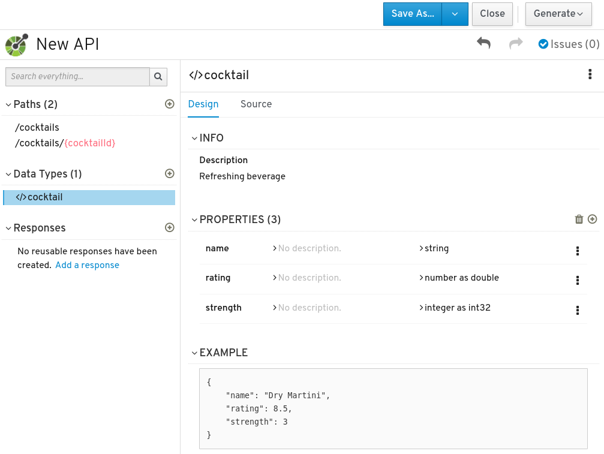

# Fuse 7.7: Contract-first-API development with Apicurio

## Prerequisites: prepare the OpenShift cluster

If deploying this app to an OpenShift cluster, first add your Red Hat registry token as a Secret in your project:

```
oc create secret docker-registry redhat-registry-secret \
  --docker-username="12345678|yourserviceaccountname" \
  --docker-password=xxxxxxxx \
  --docker-server=registry.redhat.io

oc secrets link builder redhat-registry-secret

oc secrets link default redhat-registry-secret --for=pull
```

add the Fuse imagestreams first, into the `openshift` project, e.g.:

```
oc import-image fuse7-java-openshift:1.7 -n openshift --from=registry.redhat.io/fuse7/fuse-java-openshift:1.7

oc tag registry.redhat.io/fuse7/fuse-java-openshift:1.7 openshift/fuse7-java-openshift:1.7
```

## First: design an API

First Run API Designer / Apicurio Studio in your environment.

- **Run locally:** with [Docker compose](https://github.com/Apicurio/apicurio-studio/blob/master/distro/docker-compose/Readme.md)
- **Run on OpenShift:** by deploying the API Studio operator into your Project:

```
oc get packagemanifests -n openshift-marketplace
oc describe packagemanifest fuse-apicurito -n openshift-marketplace

oc new-project fuse-api

oc apply -f - <<API
apiVersion: operators.coreos.com/v1
kind: OperatorGroup
metadata:
  name: tomd-apicurio-operators
  namespace: fuse-api
spec:
  targetNamespaces:
  - tomd-apicurio
API

oc apply -f - <<API
apiVersion: operators.coreos.com/v1alpha1
kind: Subscription
metadata:
  name: fuse-apicurito-sub
  namespace: fuse-api
spec:
  channel: alpha
  name: fuse-apicurito
  source: redhat-operators
  sourceNamespace: openshift-marketplace
API

oc apply -f - <<API
apiVersion: apicur.io/v1alpha1
kind: Apicurito
metadata:
  name: apicurito-service
  namespace: fuse-api
spec:
  size: 1
API
```

Wait a little while. The Apicurito pods should eventually come up:

```
$ oc get pod
NAME                                           READY   STATUS    RESTARTS   AGE
apicurito-operator-5f7858dd6f-668vp            1/1     Running   0          79s
apicurito-service-generator-645f4f57bd-ptjvs   1/1     Running   0          43s
apicurito-service-ui-d7bbf5bd5-jvpsq           1/1     Running   0          43s
```

Fetch the URL to the API Designer UI and open it (e.g. `xdg-open`, `open`...)

```
xdg-open https://$(oc get route apicurito-service-ui --template '{{.spec.host}}')
```

In API Designer, create a new API, and then design it however you like: 🍸



When you've finished, save/download the JSON from API Designer.

## Generate Camel routes from the OpenAPI spec and run the app

1.  Copy the OpenAPI JSON file to `src/spec/openapi-spec.json`:

    ```
    mkdir src/spec
    mv ~/Downloads/openapi-spec.json ./src/spec
    ```

2.  Then generate REST DSL Java code for Camel, by running the camel-restdsl-openapi-plugin:

    ```
    mvn camel-restdsl-openapi:generate-with-dto
    ```

    See [camel-restdsl-openapi-plugin 2.23 documentation](https://github.com/apache/camel/blob/camel-2.23.2/tooling/maven/camel-restdsl-swagger-plugin/src/main/docs/camel-restdsl-swagger-plugin.adoc) for all the configuration options available.

3.  Implement any Camel routes as required (one sample method has already been provided in `CamelRouter`).

4.  Finally, deploy the application to OpenShift:

    ```
    mvn fabric8:deploy -Popenshift    
    ```

    Or, you can run it locally.

    ```
    mvn clean spring-boot:run
    ```

## Troubleshooting an IDE

To compile in an IDE such as IntelliJ IDEA, make sure that you mark the following directories as containing generated sources (right-click, Mark Directory As &rarr; Generated Sources Root):

- target/generated-sources/openapi/src/main/java
- target/generated-sources/restdsl-openapi

Both of these directories contain generated code which must be included in the classpath when the app runs.
